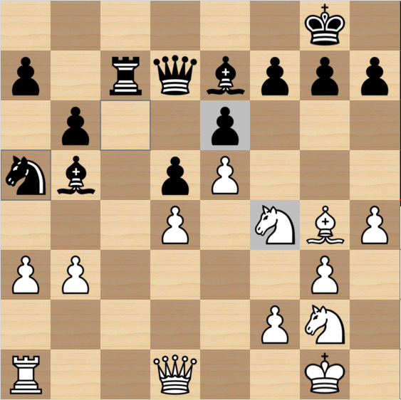
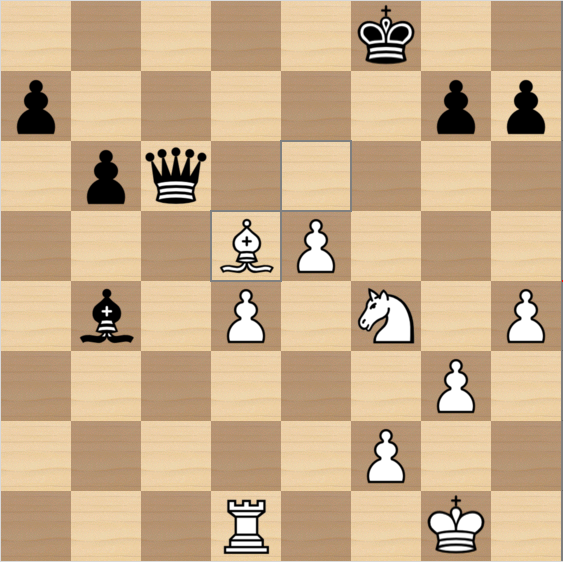

# Petrel is UCI Chess Engine


Petrel is a conventional alpha-beta search engine, but some implementation details set it apart from others.

Petrel 4.0 rated `3536` Elo on the [CCRL Blitz](https://computerchess.org.uk/ccrl/404/cgi/engine_details.cgi?eng=Petrel%204.0%2064-bit) list; `3440` Elo on the [CCRL 40/15](https://computerchess.org.uk/ccrl/4040/cgi/engine_details.cgi?print=Details&each_game=0&eng=Petrel%204.0%2064-bit).

## Supported UCI options

```
option name Hash type spin min 0 max 16384 default 64
option name Move Overhead type spin min 1 max 10000 default 1
option name Ponder type check default false
option name UCI_Chess960 type check default false
option name Debug type check default false
option name Debug Log File type string default <empty>
```
Only input errors and a sparse search warnings will be written into `Debug Log File` (unless option `Debug true` or `debug on` is set
then all engine input and output will be logged).

## Command-line options

```
Options:
    -f|--file [FILE]                Read and execute initial UCI commands from the specified file.
    -b|--bench|bench [GO LIMITS]    Search a set of benchmark positions, report total nodes and nps, and exit.
    -v|--version                    Display version information and exit.
    -h|--help                       Show this help message and exit.
```
You can provide a configuration file. This file should contain UCI commands. `--file` and `--bench` can be used together.

## Features

* [**Unique position representation**](https://www.chessprogramming.org/Piece-Sets) – neither bitboards nor mailbox, based on 128-bit SIMD vectors
* [**Hyperbola Quintessence**](https://www.chessprogramming.org/Hyperbola_Quintessence) for sliding pieces attack generation
* [**Incrementally updated attack tables**](https://www.chessprogramming.org/Attack_and_Defend_Maps)
* **Bulk legal move generation** directly from attack tables
* Unorthodox search framework (moves played out of unordered **bitset** of remaining legal moves)
* Fast **Simplified SEE based on attack tables**
* Supports FRC add DFRC chess variants

## Evaluation

* Versions 1.x and 2.x use verbatim [**PeSTO** evaluation](https://www.chessprogramming.org/PeSTO%27s_Evaluation_Function)
* Versions 3.x `(768 -> 128)*2 -> 1` (dual perspective accumulator, SCReLU activation) [NNUE](https://github.com/jw1912/bullet/blob/main/docs/1-basics.md).
* Version 4.0 `(768 -> 1024)*2 -> 1`

NN trained with [bullet](https://github.com/AleksPeshkov/bullet) on Lc0 data filtered by Linrock (1B positions).

## Search

* **Principal Variation Search (PVS)**
* **Quiescence search** with **SEE pruning** of losing captures
* **SEE Reductions** – different reduction of losing captures, unsafe and safe quiet moves
* **Null Move Pruning**
* **SEE Pruning**
* **Static Null Move Pruning**

No history counters, thus no history pruning, corrhist, LMR, etc.

## Move Ordering

Relatively sophisticated scheme:

0. Hash move
1. SEE non-losing queen promotions
2. SEE non-losing captures sorted by **MVV/LVA**
3. **Killer Move Heuristic** – 2 moves per ply
4. **Counter Move Heuristic** – 2 out of 4 moves in a slot
5. **Follow-up Move Heuristic** – 2 out of 4 moves in a slot
6. Quiet QRBN moves from **SEE-unsafe** to **safe** squares
7. Safe passed pawns moves
8. Safe pawn moves threatening opponent pieces
9. Quiet NBRQ moves from **safe** to **safe** squares
10. King quiet moves
11. Losing queen promotions and captures – low valued pieces first
12. Remaining pawn moves – most advanced first
13. SEE losing quiet moves – low valued pieces first

## Examples of petrel's games [[PGN1]](20251231_1705_petrel_3.2_N128_JA_2025-12-21_vs_EveAnn_3.6_64-bit.pgn) [[PGN2]](215_petrel_34_ja_2026-03-20_vs_schoenemann.pgn)
<div align="center">

**6k1/p1rqbppp/1p2p3/nb1pP3/3P1NBP/PP4P1/5PN1/R2Q2K1 w - - 0 26**

</div>
<div align="center">
  <div style="display: inline-block; width: 45%;">
    <div style="font-size: 0.8em; color: gray; margin-top: 6px;">before&nbsp;26.Nxe6:</div>
    
  </div>
  <div style="display: inline-block; width: 45%;">
    <div style="font-size: 0.8em; color: gray; margin-top: 6px;">...finally&nbsp;after&nbsp;34.Bxd5:</div>
    
  </div>
</div>

## Credits

* Jim Ablett for [Windows, Linux and Android PGO builds](https://jim-ablett.kesug.com/), icon and code improvements
* Linmiao Xu (Linrock), guru of NNUE training for cooked data and [description what he did](https://www.kaggle.com/competitions/fide-google-efficiency-chess-ai-challenge/writeups/linrock-my-solution-cfish-nnue-data-1st)

---

*Aleks Peshkov, [https://github.com/AleksPeshkov/petrel](https://github.com/AleksPeshkov/petrel)*
